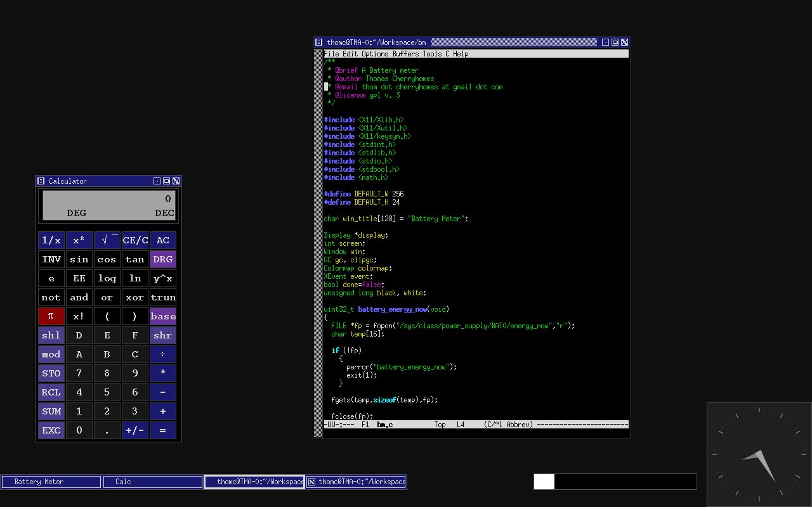

# battery-meter
A Battery meter for X11 written in pure Xlib.



## why

I was putting together a minimal X11 environment on my smaller Thinkpad T61 laptop based around twm and Xaw. I wanted a simple battery meter, so I wrote one.

## usage

```sh
bm <xpos> <ypos> <width> <height>
```

* xpos = the X pixel position on screen
* ypos = the Y pixel position on screen
* width = the width of the battery bar, in pixels
* height = the height of the battery bar, in pixels

## example

On my Thinkpad T61 with 1280x800 display, putting close to lower right, next to my clock (as in the screenshot)

```sh
bm 840 766 256 16
```

## license

Licensed under GPL v. 3, see LICENSE file for details.

## author

Thomas Cherryhomes <thom.cherryhomes at gmail.com>

